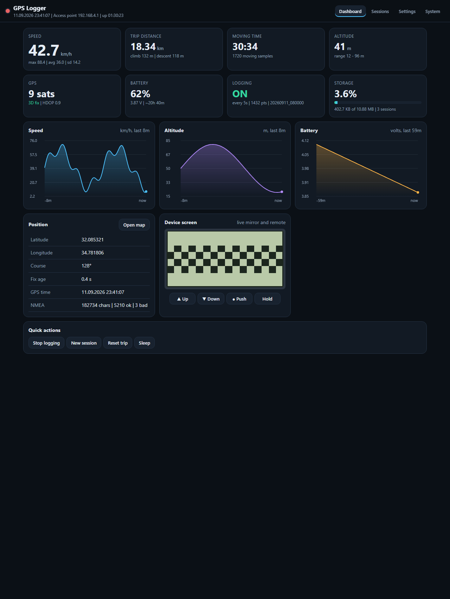
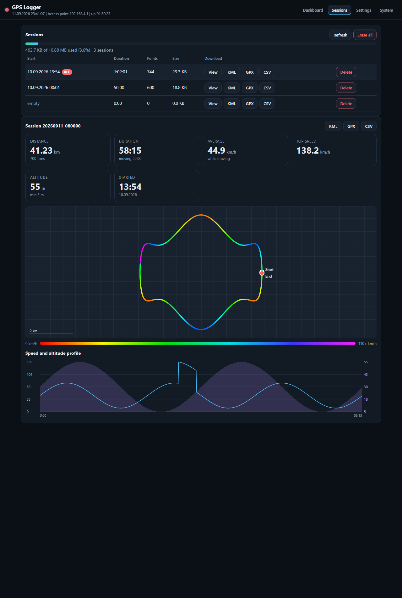
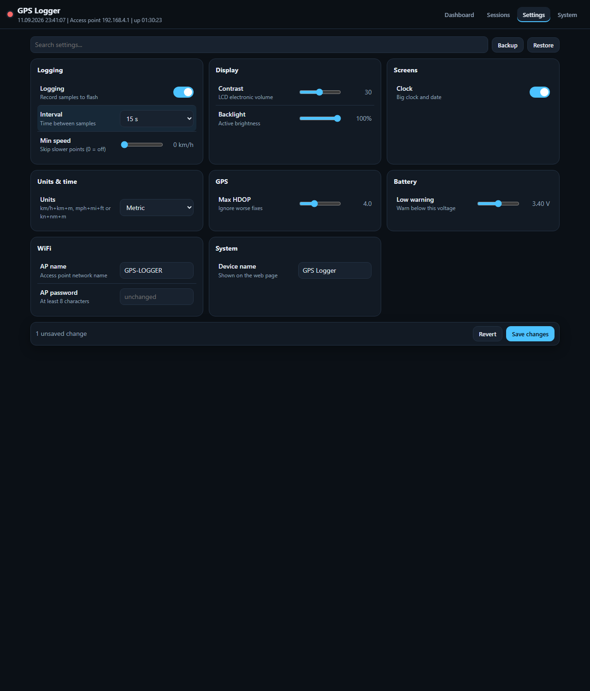
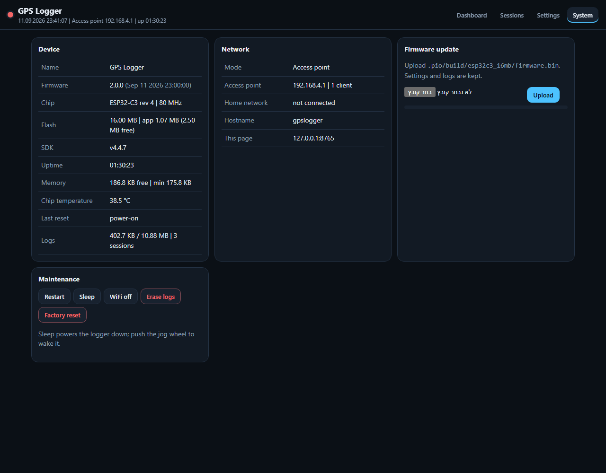
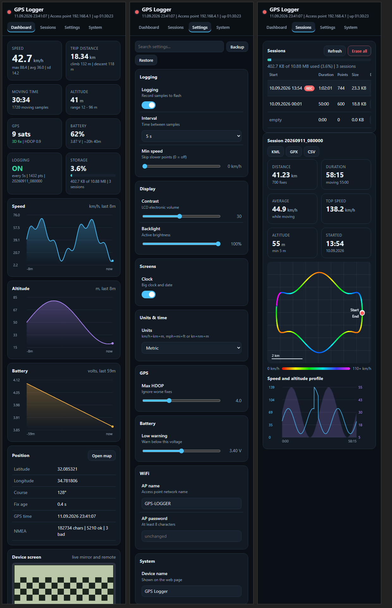
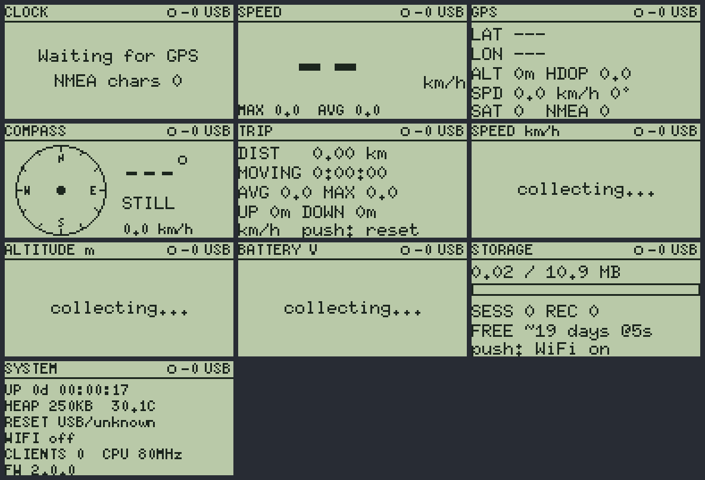
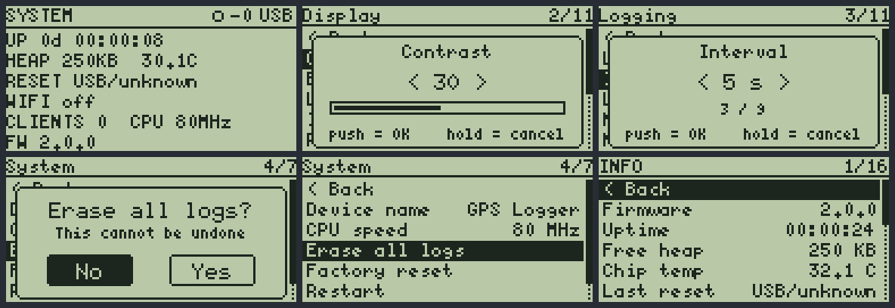

# GPS Logger ESP32-C3 📍

A pocket GPS logger built around the **ESP32-C3** with a 128×64 **ST7567** LCD, a 3-way jog wheel and **16 MB of flash** for months of track data - plus a full **web app** served straight from the device: live dashboard, speed-colored track maps, KML/GPX/CSV export, every setting, firmware updates, and a **live mirror of the device screen that you can remote-control from your phone**.

  

<p align="center">
  
</p>

> Successor of [GPS_Logger_ESP8266](https://github.com/amir684/GPS_Logger_ESP8266) and uses the same LCD as [stm32f051-mini-console](https://github.com/amir684/stm32f051-mini-console).
> Screenshots of the web app use demo data. Real photos of the build live in [`images/`](images/).

---

## ✨ Highlights

- 🛰️ **GPS logging** to LittleFS (~10.9 MB): 32-byte binary records, one file per session, automatic rotation of the oldest sessions
- 🗺️ **Exports** in **KML** (speed-colored track, start/end markers, legend, trip summary - opens in Google Earth / My Maps), **GPX 1.1** (Strava, OsmAnd, Garmin) and **CSV** (GPS Visualizer / Excel)
- 🎛️ **On-device menu** with 50+ settings in 8 groups, edit popups, confirmation dialogs, scrolling lists and an info page - all driven by the jog wheel
- 📺 **10 dashboard screens**: clock, speedometer, GPS details, compass, trip statistics, speed / altitude / battery graphs with statistics view, storage, system
- 🌐 **Web app** (access point or home WiFi): live KPIs and charts, session browser with track map and speed/altitude profile, generated settings form with search and backup/restore, system info, **OTA firmware update**, **live LCD mirror + remote buttons**
- 📶 **Captive portal** on the access point, **mDNS** (`http://gpslogger.local`) on the home network, optional web password, WiFi auto-off when idle
- 📊 **Statistics everywhere**: distance with jitter filter, moving time, mean / max / standard deviation of speed, climb and descent with hysteresis, 98th-percentile color scale for tracks
- 😴 **Deep sleep** from the menu, the web page, automatically on low battery, or by **holding the wheel for 3 seconds** - push the wheel to wake up
- 🔧 **Serial console** for everything: settings, exports, screen dump, key injection, web self-test, hardware bring-up tools

---

## 📸 Screenshots

### Web app

| Dashboard | Sessions and track map |
|---|---|
|  |  |
| **Settings** (generated from the firmware's settings table) | **System** (device info, OTA update, maintenance) |
|  |  |

**On a phone:**

<p align="center"></p>

### Device screen

Captured from the real frame buffer with the `scr` console command:

<p align="center"></p>
<p align="center"></p>

---

## 🛠️ Hardware

| Part | Notes |
|---|---|
| **ESP32-C3-WROOM-02U** | 16 MB flash, native USB, U.FL antenna connector (attach an antenna before enabling WiFi) |
| **ST7567 128×64 LCD** (JLX12864 type, SPI) | Same panel as the STM32 mini console, driven with U8g2 |
| **3-way jog switch** | Up / down / push, common to GND |
| **ATGM336H GPS** (or any NMEA module) | 3.3 V, 9600 baud by default, only its TX line is used |
| Li-ion cell + TP4056 charger | Optional, for portable use |
| 3.3 V LDO, ≥500 mA (ME6211, RT9080) | Not AMS1117 - its dropout is too high for a single cell |
| 2× 100 kΩ + 100 nF | Battery voltage divider |
| N-MOSFET (AO3400) or NPN (S8050) | Optional backlight driver, see [Backlight](#backlight) |

### Wiring

**LCD (ST7567)**

| LCD | ESP32-C3 |
|---|---|
| LED | IO21 (pad **TXD**) |
| CS | IO10 |
| RST | IO9 |
| DC | IO5 |
| SCK | IO6 |
| SDI | IO7 |
| 3.3V / GND | 3V3 / GND |

**Jog wheel**

| Switch | ESP32-C3 |
|---|---|
| Common | GND |
| Up | IO1 |
| Push | IO3 (also the deep-sleep wake pin) |
| Down | IO4 |

**GPS**

| GPS | ESP32-C3 |
|---|---|
| VCC / GND | 3V3 / GND |
| TX | IO20 (pad **RXD**) |
| RX | not connected |

**Battery divider**

```
BAT+ --[100k]--+--[100k]-- GND
               |
              IO0 --[100nF]-- GND
```

**Other**

| Function | ESP32-C3 |
|---|---|
| USB D- / D+ | IO18 / IO19 (native USB, used for flashing and the console) |
| I2C SDA / SCL (future sensors) | IO2 / IO8 with 4.7 kΩ pull-ups to 3V3 |

All pins live in [`include/config.h`](include/config.h).

**Notes**
- The module pads are labeled by UART name: **TXD = IO21**, **RXD = IO20**.
- IO2, IO8 and IO9 are strapping pins. Pull-ups on the I2C lines keep IO2/IO8 high at boot; never pull IO9 low at power-up.
- The ATGM336H keeps satellite data on its backup cell (VBAT), which gives ~1 s hot starts after power loss.

### Backlight

On this panel the LED anode sits on 3.3 V and the `LED` wire is the cathode side, so the firmware drives it **active-low** (`LCD_LED_ACTIVE_LOW` in `config.h`). A GPIO cannot sink the full backlight current, so it is dim when driven directly. For full brightness put a transistor between the `LED` wire and GND (gate/base from IO21) and set `LCD_LED_ACTIVE_LOW = false`:

```
LCD LED wire --- Drain        AO3400
IO21 --[100R]--- Gate
        [100k] to GND
                 Source --- GND
```

---

## 🚀 Build and flash

Requirements: [PlatformIO](https://platformio.org/) (VS Code extension or CLI).

```bash
pio run -t upload          # build and flash over USB
pio device monitor         # serial console, type "help"
```

- The project uses a custom 16 MB partition table ([`partitions_16mb.csv`](partitions_16mb.csv)): two 2.5 MB app slots for OTA and ~10.9 MB LittleFS for logs.
- The first boot formats the filesystem, which takes a few seconds.
- Later updates can be uploaded from the web page (**System → Firmware update**, file `.pio/build/esp32c3_16mb/firmware.bin`). Settings and logs are kept.
- Libraries (downloaded automatically): U8g2, TinyGPSPlus, ArduinoJson.

---

## 🎮 Using the logger

### Jog wheel

| Action | Dashboard | Menu |
|---|---|---|
| Up / Down | Previous / next screen | Move, or change the value in an edit popup |
| Push | Screen action (graph ↔ statistics, trip reset, WiFi on the storage screen) or open the menu | Select / confirm |
| Hold 0.8 s, release | Open the menu | Back / cancel |
| **Hold 3 s** | **Deep sleep** (a progress bar shows while holding) | Deep sleep |
| Push while asleep | Wake up | |

With the backlight fully off, the first press only wakes the screen.

### Screens

Clock · Speed · GPS · Compass · Trip · Speed graph · Altitude graph · Battery graph · Storage · System. Each one can be hidden in **Menu → Screens**, and **Auto cycle** rotates them when idle.

The status bar shows the logging state (● recording, ○ waiting for GPS time, `F` storage full), `W` when WiFi is on, the fix and satellite count, and the battery voltage or percent (`USB` when no cell is connected).

### Web app

1. Turn WiFi on: **Menu → WiFi**, or push on the **Storage** screen.
2. Connect to **`GPS-LOGGER`** (password `12345678`). Most phones open the app automatically (captive portal); otherwise browse to **`http://192.168.4.1`**.
3. If the page does not load, turn off mobile data - phones may send traffic over cellular when the WiFi network has no internet.

For the home network set **WiFi mode** to *Home WiFi* (or *AP + Home*), enter the SSID and password on the settings page and open `http://gpslogger.local`. If the home network is unreachable the access point starts as a fallback.

| Tab | What you get |
|---|---|
| Dashboard | Speed, distance, moving time, altitude, GPS, battery, logging and storage cards; live charts; position with a map link; **live device screen with Up/Down/Push/Hold buttons**; quick actions |
| Sessions | All sessions with KML / GPX / CSV downloads; track map colored by speed with hover details, start/end markers and scale bar; speed and altitude profile |
| Settings | Every setting grouped as on the device, search, unsaved-change bar, backup and restore as JSON |
| System | Firmware, chip, memory, temperature, network details, OTA upload, restart / sleep / erase / factory reset |

### Exporting over USB

```bash
py tools/export.py COM11                 # latest session as KML
py tools/export.py COM11 gpx 20260911_143005
py tools/export.py COM11 csv all -o everything.csv
```

### Serial console

| Command | Description |
|---|---|
| `stat` | Battery, GPS, logging, WiFi, system and trip status |
| `ls` | List sessions |
| `kml` / `gpx` `[NAME\|last]`, `csv [NAME\|last\|all]` | Export a session |
| `rm NAME` / `rm all` | Delete sessions |
| `settings [GROUP]`, `get KEY`, `set KEY VALUE` | Read and change settings, e.g. `set log_int 10`, `set units imperial` |
| `defaults yes` | Factory reset settings |
| `wifi on\|off`, `restart`, `sleep` | Quick actions |
| `key up\|down\|push\|hold`, `screen N`, `scr` | Remote control and frame-buffer dump |
| `webtest [PATH]`, `webdebug on\|off` | Web server self-test and request log |
| `hw`, `bl`, `bltest`, `lcd on\|off\|frame`, `lcdinit`, `pin N 0\|1` | Hardware bring-up |

---

## ⚙️ Settings

All settings are stored in NVS and are available on the device menu, the web page and the console.

| Group | Key | Setting | Default | Options / range |
|---|---|---|---|---|
| Logging | `log_on` | Logging | ON | |
| | `log_int` | Interval | 5 s | 1 s … 5 min |
| | `log_nofix` | Log without fix | ON | keeps time, battery and satellites |
| | `log_minspd` | Min speed | 0 km/h (off) | 0-30 |
| | `log_mindist` | Min distance | 0 m (off) | 0-200 |
| | `log_split` | Split after gap | 30 min | Off, 5 min … 2 h |
| | `log_full` | When full | Delete oldest | Delete oldest, Stop logging |
| Display | `contrast` | Contrast | 30 | 0-63 |
| | `bl_level` | Backlight | 100% | 0-100% |
| | `bl_timeout` | Light timeout | 30 s | Never, 10 s … 5 min |
| | `bl_idle` | Idle light | 0% | 0-50% |
| | `rotate` / `invert` | Rotate 180 / Invert | OFF | |
| | `start_scr` | Start screen | Clock | any screen |
| | `autocycle` | Auto cycle | Off | 5 s … 1 min |
| | `clock_sec` / `clock_12h` | Clock seconds / 12-hour clock | ON / OFF | |
| | `bat_show` | Battery shows | Voltage | Voltage, Percent |
| Screens | `scr_*` | Show each dashboard screen | ON | |
| Units & time | `units` | Units | Metric | Metric, Imperial, Nautical |
| | `tz` | Time zone | Israel | 16 presets with DST rules |
| | `date_fmt` | Date format | DD.MM.YYYY | YYYY-MM-DD, MM/DD/YYYY |
| GPS | `gps_baud` | Baud rate | 9600 | 4800-115200 |
| | `gps_hdop` | Max HDOP for statistics | 4.0 | 1.0-10.0 |
| | `gps_moving` | Moving above | 2.0 km/h | 0.5-10.0 |
| | `gps_althyst` | Climb filter | 3 m | 1-20 |
| Battery | `bat_cal` | Divider ratio | 2.000 | 1.500-2.500 |
| | `bat_low` | Low warning | 3.40 V | 3.00-3.80 |
| | `bat_sleep` | Auto sleep | Off | 3.00-3.30 V |
| | `bat_mah` / `bat_load` | Capacity / average current (runtime estimate) | 2000 mAh / 60 mA | |
| WiFi | `wifi_mode` | WiFi mode | Off | Off, Access point, Home WiFi, AP + Home |
| | `ap_ssid` / `ap_pass` | Access point name / password | GPS-LOGGER / 12345678 | |
| | `sta_ssid` / `sta_pass` | Home network | empty | |
| | `hostname` | mDNS hostname | gpslogger | |
| | `wifi_txpwr` | TX power | 8.5 dBm | 2-19.5 dBm |
| | `wifi_idle` | Auto off | 10 min | Never, 5 min … 1 h |
| | `web_pass` | Web password (user `admin`) | empty | |
| System | `dev_name` | Device name | GPS Logger | |
| | `cpu_mhz` | CPU speed | 80 MHz | 80, 160 MHz |

---

## 💾 Data format

Each logging session is a file `/log/YYYYMMDD_HHMMSS.bin` (UTC start time) with an 8-byte header (`GLOG`, version, record size) followed by fixed 32-byte records:

| Field | Type | Unit |
|---|---|---|
| epoch | uint32 | UTC seconds |
| latE7, lonE7 | int32 | degrees × 10⁷ |
| altCm | int32 | cm |
| speedCms | uint16 | cm/s |
| courseCdeg | uint16 | degrees × 100 |
| hdopC | uint16 | HDOP × 100 (0xFFFF = unknown) |
| batteryMv | uint16 | mV |
| sats, flags | uint8 | bit 0 = fix |
| aux[3] | int16 | reserved for sensors |

At a 5 s interval the flash holds about 18 days of continuous logging, at 30 s about 3.5 months. Exports are generated on the fly, so they use no extra storage.

**CSV columns:** `time,latitude,longitude,elevation,speed_kmh,course,hdop,sats,fix,battery_v`

**KML:** consecutive points of the same speed bucket share one line (12 color buckets, hue red → magenta like the ESP8266 logger), so files stay small; gaps over 60 s are not joined.

### Web API

| Method | Endpoint | Description |
|---|---|---|
| GET | `/api/status` | Live GPS, trip, battery, logging, WiFi and system data |
| GET | `/api/history` | Speed, altitude and battery graph buffers |
| GET / POST | `/api/settings` | Settings schema and values / change settings (JSON object) |
| GET | `/api/sessions` | Session list |
| GET | `/api/track?f=NAME&max=N` | Track summary and downsampled points |
| GET | `/dl?fmt=kml\|gpx\|csv&f=NAME\|last` | Download an export |
| POST | `/api/delete?f=NAME` | Delete a session |
| POST | `/api/action?do=…` | `logging_on`, `logging_off`, `new_session`, `trip_reset`, `erase_logs`, `wifi_off`, `restart`, `sleep`, `factory_reset` |
| GET | `/api/lcd` | Frame buffer of the device screen |
| POST | `/api/key?k=up\|down\|push\|hold` | Press a jog-wheel key remotely |
| POST | `/api/update` | Firmware upload (multipart) |

---

## 🗂️ Project structure

```
include/config.h        pins and hardware options
include/version.h       firmware name and version
partitions_16mb.csv     OTA app slots + LittleFS
src/main.cpp            setup, sampling loop, logging filters
src/settings.*          settings table, NVS persistence, parsing and formatting
src/ui.*  src/menu.*    dashboard screens, status bar, backlight, jog-driven menu
src/logger.*            session files, rotation, usage cache
src/export.*            CSV, KML, GPX and track JSON
src/gps.*  src/trip.*   NMEA parsing, clock sync, trip statistics
src/battery.*           voltage, percent, runtime estimate
src/net.*  src/web.*    WiFi modes, captive portal, mDNS, HTTP API, OTA
src/web_page_*.h        the single-page web app (HTML, CSS, JavaScript)
src/app.*               shared actions, deep sleep, delayed restart
src/console.*           serial command shell
tools/export.py         download sessions over USB
images/                 photos and screenshots
```

---

## 🐛 Troubleshooting

| Problem | Fix |
|---|---|
| Web page does not load on the phone | Turn off mobile data, use `http://192.168.4.1` (not https), try another browser. `webtest /` on the console checks the server. |
| WiFi network disappears | WiFi turns off after the idle time with no clients (`wifi_idle`); turn it on again from the menu. |
| Display blank | Check 3.3 V and GND at the LCD, SCK/SDI order, and contrast (`set contrast 30`). |
| Backlight dim or inverted | See [Backlight](#backlight); `bltest` cycles the LED pin modes. |
| GPS screen shows `NMEA 0` | Check GPS TX → IO20 (RXD pad) and the baud rate (`gps_baud`). |
| No time / no logging | Logging starts once GPS time is known; the first fix can take a few minutes outdoors. |
| USB port vanished | The logger is in deep sleep - push the wheel. |

---

## 🔮 Roadmap

- Backlight transistor for full brightness
- GPS power switching during sleep (hot start from the backup cell)
- Environmental sensors on the I2C bus, logged into the `aux` fields
- Offline map tiles for the track view

---

## 👤 Author

Designed and built by **AmirY** - GitHub [@amir684](https://github.com/amir684).

If you use this project or build on it, please keep the credit and the [NOTICE](NOTICE) file.

## 📜 License

Copyright (c) 2026 AmirY. Licensed under the [Apache License 2.0](LICENSE) - see [NOTICE](NOTICE) for attribution requirements and third-party libraries.
